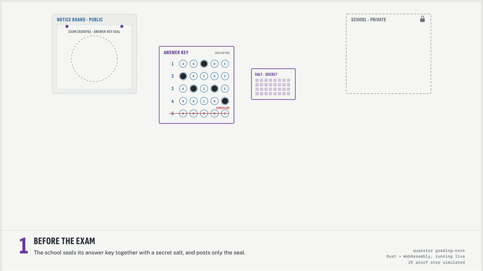
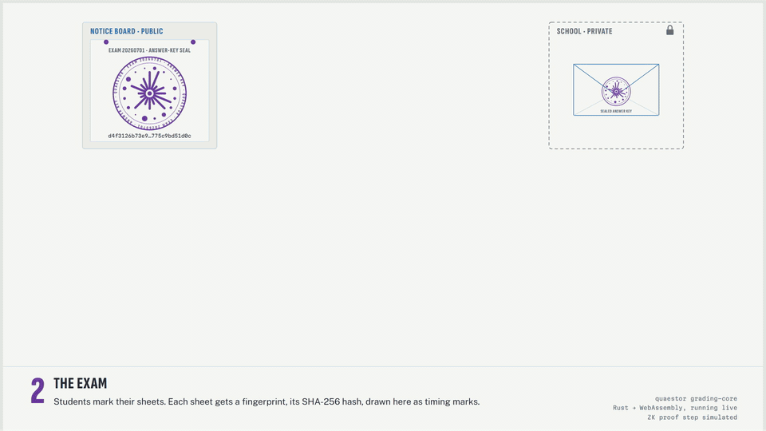
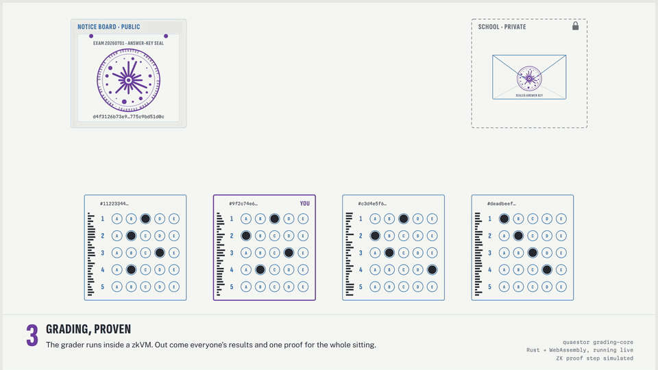
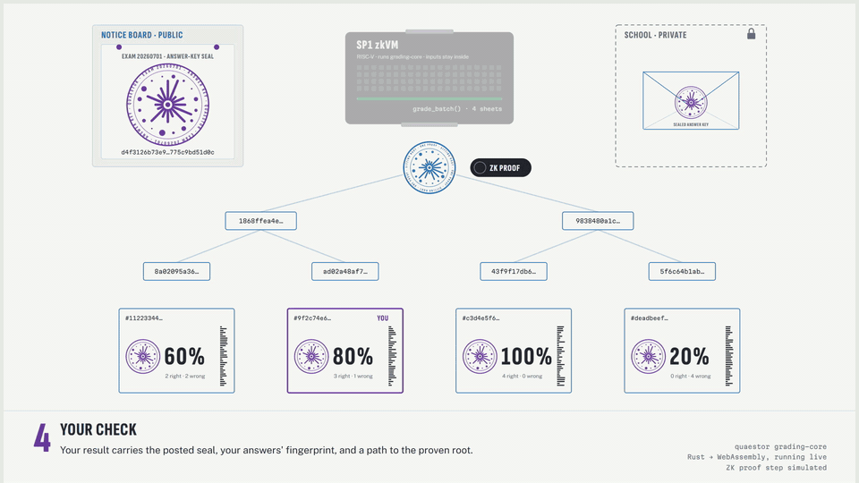
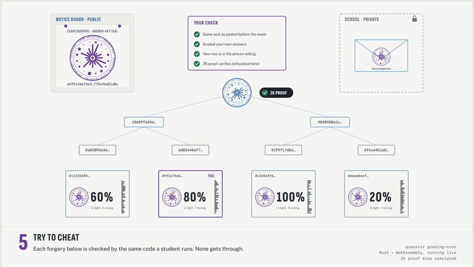
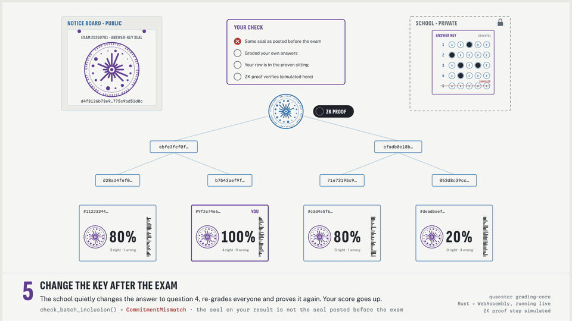
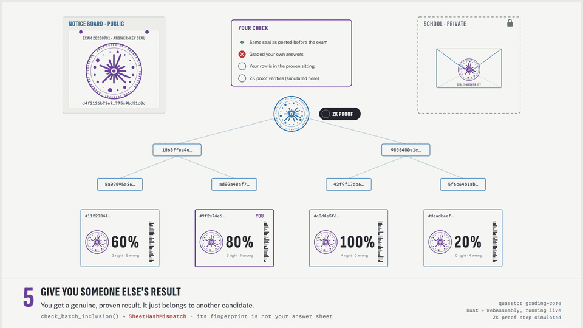
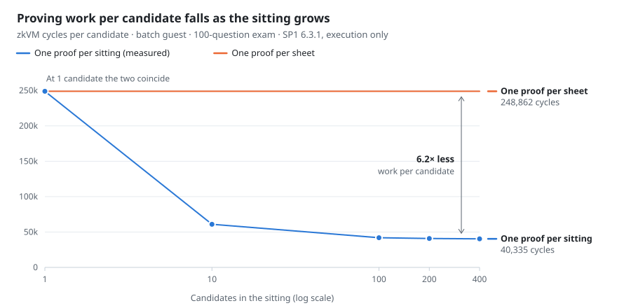
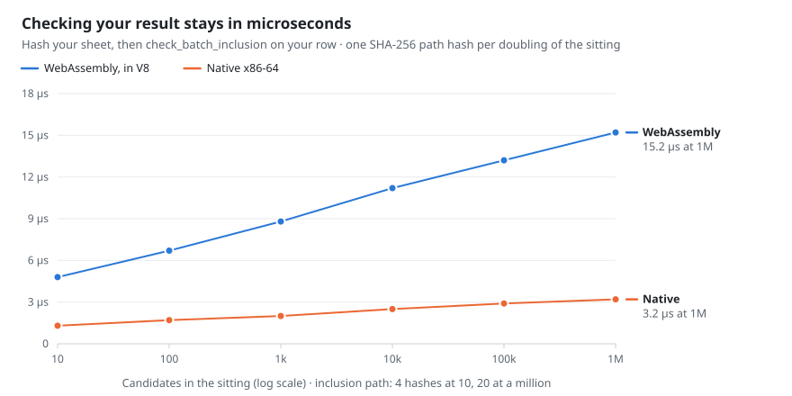

# quaestor

[](https://github.com/kadircanyildirm-crypto/quaestor/actions/workflows/ci.yml)
[](#license)

**Verifiable grading.** quaestor proves that an exam score was computed from
the answer key the institution committed to before the exam, and from the
candidate's own answers, without revealing the key.

The grading engine runs inside the [SP1](https://github.com/succinctlabs/sp1)
zkVM. Before the exam, the institution publishes a salted SHA-256 commitment to
its answer key. After the exam, it grades the entire sitting in one zkVM
execution and publishes a single proof together with a results list. Using only
public data and their own answer sheet, each candidate can confirm that the
score published for them is the score that was proven.

> [!NOTE]
> The grading core, both zkVM guests and the complete verification pipeline are
> implemented and tested. A real SP1 proof has not been generated yet: proving
> requires at least 24 GB of memory. See [Status](#status).

## Walkthrough

The animations follow one exam from commitment to verification, then show
three forgeries being rejected. They are rendered from a WebAssembly build of
`grading-core` ([`crates/grading-wasm`](crates/grading-wasm)) running on
[`examples/demo-exam`](examples/demo-exam), so every hash, score, Merkle path
and verdict on screen is real output of this code. The SP1 proof itself is
illustrated, not generated.

Commitments are drawn as seals: the 16 rays and 16 dots encode the 32 bytes of
the digest. Sheet hashes are drawn as the timing marks along a sheet's edge.
Equal digests produce identical figures, and any change to the input produces a
completely different one.

### 1. Commitment



Before the exam, the institution publishes `C = commit_answer_key(K, s)`, a
SHA-256 digest of the canonically encoded answer key `K` and a secret 32-byte
salt `s`. The salt makes the commitment hiding, since answer keys have too
little entropy to survive a brute-force search on their own. SHA-256 makes it
binding. Demo commitment: `d4f3126b…9bd51d0c`.

### 2. The sitting



Each sheet is identified by a 32-byte pseudonym rather than a name.
`hash_answer_sheet` computes its sheet hash `H`, which the candidate can
recompute at any time from their own copy of their answers. In the demo exam,
question 3 accepts two answers after an appeal and question 5 is cancelled under
the full-credit policy.

### 3. Grading and proof



The batch guest (`zk/program-batch`) runs `grade_batch(K, s, sheets)` inside
SP1. The key is validated and committed once per sitting. Each sheet is scored,
each report is hashed into a Merkle leaf, and the root is bound to the number of
candidates. The guest commits 76 bytes of public values (`C`, the root, the
exam id and the candidate count), so one proof covers the whole sitting.
Measured cost on a 100-question exam is about 214,000 + 39,800 × n zkVM cycles
([benchmarks](docs/BENCHMARKS.md)).

### 4. Verification



The candidate holds the proof, the published results list, the pre-exam
commitment and their own answer sheet. Once the proof verifies,
`check_batch_inclusion` confirms three things: the proof is under the published
commitment, the report carries the candidate's sheet hash, and the report's
inclusion path reaches the proven root. This check needs no zkVM and costs a
few dozen hash evaluations. `quaestor-cli verify-batch` runs the full sequence.

### 5. Forgery: answer key changed after the exam



The institution changes the answer to question 4, re-grades the sitting and
proves it again. The new proof is valid and the candidate's score rises to 100%,
but the edited key has a different commitment (`b361aaa4…`).
**Rejected:** `CommitmentMismatch`.

### 6. Forgery: another candidate's result



The candidate is handed a genuine, proven result that belongs to someone else.
Its sheet hash is not the hash of the candidate's answers.
**Rejected:** `SheetHashMismatch`.

### 7. Forgery: score raised after proving



After the proof is published, the results list shows a 60% candidate as 100%.
The edited report hashes to a different leaf (`8a02095a…` becomes `8ae3296e…`),
and its inclusion path no longer reaches the proven root.
**Rejected:** `NotInBatch`.

## Motivation

When a candidate appeals a grade, the institution's answer is usually that the
system computed it. Neither the candidate nor an auditor or court can verify that

- the answer key was not changed after the exam,
- the published scoring rules (weights, cancelled questions, accepted answers)
  were actually applied, and
- the candidate's own answer sheet was the one graded.

Answer-key and grade-tampering incidents recur in national examination systems.
Policy work on algorithmic accountability (OECD, Ada Lovelace Institute) calls
for transparency registers and audits. quaestor offers a stronger guarantee: a
proof. The approach follows Kroll et al., *Accountable Algorithms* (University
of Pennsylvania Law Review, 2017); general-purpose zkVMs make it practical.

## The proven statement

For a sitting of `n` candidates, the batch guest proves:

> There exist an answer key `K` and a salt `s` such that `commit(K, s) = C`, and
> grading `K` against the sitting's answer sheets yields reports `R₁ … Rₙ` whose
> Merkle root, bound to `n`, is `root`.

**Public:** `C` (published before the exam), `root`, the exam id and `n`. Each
report `Rᵢ` and its inclusion path are published in the results list.
**Private:** `K` and `s`.

A single-sheet guest (`zk/program`) proves the per-candidate form of the same
statement, with public values `(C, H, R)`.

### What a valid proof establishes

- The scores were produced by the published grading program. The guest's image
  ID pins the exact code.
- The answer key used is the one committed before the exam.
- Each report was computed from the answer sheet with hash `H`, so a candidate
  can detect substitution of their answers.

### What it does not establish

- **Chain of custody.** The proof covers the recorded answers, not the paper
  sheet. Scanning is outside the proof boundary.
- **Key correctness.** The proof shows that the committed key was applied, not
  that it is academically correct. Appeals still exist; their effects become
  visible as new commitments.
- **Row ownership, for auditors.** A Merkle leaf contains the report but not the
  pseudonym. Candidates can detect a relabelled row with their own sheet; an
  auditor holding no sheets cannot.

The full design and trust model are in [docs/ARCHITECTURE.md](docs/ARCHITECTURE.md).

## Benchmarks

Two costs decide whether verifiable grading is practical: the work the
institution proves once per sitting, and the work each candidate does to check
their own result. Both are measured below. What is not measured yet is listed at
the end of this section.

### Proving: one proof per sitting

<picture>
  <source media="(prefers-color-scheme: dark)" srcset="docs/media/bench-proving-dark.svg">
  
</picture>

| Candidates | Total cycles | Cycles per candidate |
|---:|---:|---:|
| 1 | 248,862 | 248,862 |
| 10 | 609,370 | 60,937 |
| 100 | 4,193,494 | 41,934 |
| 200 | 8,174,020 | 40,870 |
| 400 | 16,134,045 | 40,335 |

A cycle is one instruction executed by the zkVM. It is the unit SP1 proves, so
within one shard configuration proving time grows roughly linearly with it.

- **A fixed cost of about 214,000 cycles per sitting.** Validating the key,
  encoding it canonically and hashing its commitment do not depend on the
  sheets. One proof per sheet pays this cost for every candidate; a sitting proof
  pays it once.
- **A flat marginal cost of 39,800 cycles per candidate.** It is consistent to
  within 0.6% across every interval measured, so the total grows linearly:
  `cycles ≈ 214,000 + 39,800 × n`. At 400 candidates a sitting proof does 6.2×
  less work per candidate than per-sheet proofs, and the ratio approaches 6.25×.
- **Hashing, not grading, dominates.** Raising the exam from 5 to 100 questions
  (20× more grading work) raised the per-candidate cost by only about 33%. The
  guests use software SHA-256, so SP1's SHA-256 precompiles are the most
  promising next optimisation.

### At exam scale

Projected from the fit above. SP1 proves execution in shards of 2²⁴ cycles,
which holds about 416 candidates.

| Sitting | zkVM cycles | SP1 shards |
|---:|---:|---:|
| 1,000 | 40.0 M | 3 |
| 10,000 | 398 M | 24 |
| 100,000 | 3.98 G | 238 |
| 1,000,000 | 39.8 G | 2,378 |

Shards are proven one after another, so memory stays flat as the sitting grows
and only proving time increases. A machine that can prove a 1,000-candidate
sitting can prove a national one, given proportionally more time.

### Checking: what each candidate does

<picture>
  <source media="(prefers-color-scheme: dark)" srcset="docs/media/bench-checking-dark.svg">
  
</picture>

| Candidates | Inclusion path | Data per candidate | Native x86-64 | WebAssembly (V8) |
|---:|---:|---:|---:|---:|
| 10 | 4 hashes | 220 B | 1.3 µs | 4.8 µs |
| 100 | 7 hashes | 316 B | 1.7 µs | 6.7 µs |
| 1,000 | 10 hashes | 412 B | 2.0 µs | 8.8 µs |
| 10,000 | 14 hashes | 540 B | 2.5 µs | 11.2 µs |
| 100,000 | 17 hashes | 636 B | 2.9 µs | 13.2 µs |
| 1,000,000 | 20 hashes | 732 B | 3.2 µs | 15.2 µs |

- **The timed work is the candidate's complete claim check:** hashing their own
  answer sheet, then running `check_batch_inclusion` on their row.
- **Cost grows with log₂ n, not n.** Each doubling of the sitting adds one
  32-byte hash to the inclusion path. In a sitting of a million candidates, a
  candidate needs their 92-byte report and 20 hashes, which is under 1 KB, and
  the check takes 15 µs in a browser engine.
- **Publishing is cheap too.** Re-grading a million-sheet sitting natively to
  build the results list takes 1.3 s.
- These times exclude verifying the SP1 proof itself, which comes first and has
  not been measured yet.

### Not measured yet

- Proving time and proof size, on CPU and GPU. SP1 6.3.1 needs at least 24 GB of
  memory; see [Status](#status).
- Verification of the SP1 proof, natively and in a browser.
- Cycle counts with SP1's SHA-256 precompiles enabled.

<details>
<summary><b>Method and reproduction</b></summary>

**Proving.** zkVM execution without proving (`quaestor-cli execute-batch`) under
SP1 6.3.1, on an Intel Core i5-12450H, 2026-07-27. Inputs come from
`bench/generate-sitting.py` with fixed seeds and a fixed key: 100 questions,
5 choices, one cancelled question, and every 17th question with two accepted
answers.

**Checking.** The same exam shape, graded with `grade_batch` at 10 to 1,000,000
candidates; the middle candidate's row is checked. Each figure is the median of
15 rounds of 20,000 checks, with rounds interleaved across sittings so that
clock drift affects every size equally. Native: Rust 1.96, `--release`.
WebAssembly: [`crates/grading-wasm`](crates/grading-wasm) on Node.js 26
(V8 14.6). Same machine, 2026-10-01.

```sh
# proving work (zkVM cycles)
python bench/generate-sitting.py 1 10 100 200 400
docker run --rm -v "$PWD":/work   -v quaestor-cargo-registry:/usr/local/cargo/registry -v quaestor-sp1:/root/.sp1   -w /work rust:1 bash bench/cycles.sh 1 10 100 200 400

# checking cost
cargo run --release -p grading-core --example verify_cost -- --fixtures bench/out/verify-fixtures.json
(cd crates/grading-wasm && cargo build --release --target wasm32-unknown-unknown)
node bench/verify-wasm.mjs

# charts
python bench/plot.py
```

The full analysis is in [docs/BENCHMARKS.md](docs/BENCHMARKS.md).

</details>

## Status

| Component | State |
|---|---|
| `grading-core` | Done. Deterministic `no_std` grading engine with canonical encodings, salted commitments, weighted scoring, multiple accepted answers and two cancellation policies. 84 tests, including property-based tests for commitment binding, encoding round-trips and adversarial decoding. |
| Public-values ABI | Done. Fixed layouts of 92 bytes per sheet and 76 bytes per sitting, defined in one module shared by guests and verifiers. |
| SP1 guests and CLI | Done. Both guests build under SP1 6.3.1 (pinned exactly, because the image ID is part of the claim) and execute in the zkVM: 42,518 cycles for one demo sheet, 119,700 for a three-candidate sitting. |
| Batching | Done. One proof per sitting, plus a `log₂(n)` inclusion path per candidate. |
| Forgery rejection | Done. The end-to-end pipeline (`zk/run-in-docker.sh`) rejects six forgeries: a proof checked against another candidate's answers, an unpublished commitment, a candidate absent from the sitting, a score raised after proving, the edited list re-audited in full, and swapped identities. |
| Determinism | Verified. The Merkle root computed by the host equals the root committed by the guest, byte for byte, on x86-64 and RISC-V. |
| Proof generation | **Blocked on hardware.** SP1 6.3.1 requires at least 24 GB of memory, and proving was killed for lack of memory on a 16 GB machine. All end-to-end runs so far used `SP1_PROVER=mock`, which exercises quaestor's logic but not SP1's cryptography. |
| Planned | Proving time, proof size and verification benchmarks (CPU and GPU), a browser verifier, and a pilot with a real course. See [docs/ROADMAP.md](docs/ROADMAP.md). |

## Getting started

The grading core is plain Rust and needs no zkVM toolchain:

```sh
cargo test
```

The proving layer builds on Linux or WSL2 (see [zk/README.md](zk/README.md)),
or on any platform through Docker. On machines with less than 24 GB of memory,
add `-e SP1_PROVER=mock` to run the full pipeline without SP1's cryptography:

```sh
docker run --rm -v "$PWD":/work \
  -v quaestor-cargo-registry:/usr/local/cargo/registry \
  -v quaestor-sp1:/root/.sp1 \
  -w /work rust:1 bash zk/run-in-docker.sh
```

The host CLI, `quaestor-cli`, covers both sides of the protocol:

```sh
quaestor-cli prove-batch  --key key.json --salt <hex> --sheets sheets/ \
                          --out batch.bin --manifest sitting.json
quaestor-cli verify-batch --proof batch.bin --manifest sitting.json \
                          --commitment <hex> --sheet my-sheet.json
```

## Repository layout

```text
crates/grading-core/   grading engine: model, encodings, commitments, scoring, batching, public values
crates/grading-wasm/   WebAssembly bindings for grading-core (browser explainer, checking benchmark)
zk/program/            SP1 guest for a single answer sheet
zk/program-batch/      SP1 guest for a whole sitting
zk/script/             quaestor-cli: execute, prove and verify, per sheet and per sitting
examples/demo-exam/    demo answer key and answer sheets
bench/                 benchmark scripts and chart generator
docs/                  architecture, benchmarks and roadmap
```

## Design constraints

Everything in `grading-core` must run unchanged inside a zkVM guest:

1. **Determinism.** Scores are integer basis points. No floating point, no
   map iteration order, no clocks, no randomness.
2. **`no_std` + `alloc`.** Guests have no operating system.
3. **Hand-written canonical encodings.** Commitment security must not depend on
   the stability of a serialization library.

## Non-goals

No blockchain and no tokens. Proving and verification are ordinary
computations, and publishing a commitment requires nothing more than the
institution's website or any append-only transparency log.

## About the name

A *quaestor* was the Roman magistrate responsible for auditing the public
accounts. The word comes from *quaestio*, "an inquiry".

## License

Copyright © 2026 Kadir Can Yildirim.

quaestor is licensed under the
[GNU Affero General Public License v3.0](LICENSE) (`AGPL-3.0-only`). You may
use, modify and redistribute it, including commercially, provided that any
modified version you distribute, or run as a network service for others, is
released under the same license with its complete source code.

If those terms do not fit your use, for example a closed-source product or
service, a commercial license is available from the author. Open an issue or
contact [@kadircanyildirm-crypto](https://github.com/kadircanyildirm-crypto).

Versions up to and including commit
[`dd84bb4`](https://github.com/kadircanyildirm-crypto/quaestor/commit/dd84bb4)
were released under MIT OR Apache-2.0 and remain available under those terms.
