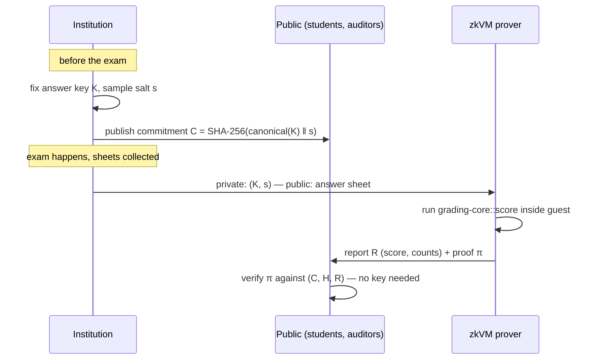

# Architecture

## Actors and flow

1. **Commit.** Before the exam, the institution canonically encodes the answer
   key (questions, weights, accepted choices, cancellation policy), appends a
   random 32-byte salt, hashes with SHA-256, and publishes the digest `C`.
2. **Grade + prove.** After the exam, for each answer sheet the zkVM guest
   receives `(K, s)` as private witness and the sheet as input, validates the
   key structurally, computes the score, and commits `(C, H, R)` as public
   outputs. The host produces proof `π`.
3. **Verify.** Anyone holding `(C, H, R, π)` verifies in milliseconds. The
   student recomputes `H` from their own copy of their answers, checks `C`
   is the pre-exam commitment, and checks the proof.

## What a valid proof establishes

- The score was produced by the **exact published grading algorithm** (the
  guest binary is public and reproducible; its image ID pins the code).
- The key used is the one committed **before the exam** (binding of SHA-256).
- The sheet graded is the one with hash `H` — the student can detect
  substitution of their answers.
- Appeals are auditable: a post-appeal regrade is a *new* commitment `C'`
  plus proofs under `C'`; both commitments stay on the record.

## What it deliberately does NOT establish (trust model)

Honesty about limits is what makes this credible:

- **Chain of custody.** ispat proves "these recorded answers score X", not
  "these recorded answers are what the student bubbled on paper." OMR
  digitization sits outside the proof boundary (a future component can sign
  scans and hash-link them to `H`).
- **Key quality.** The proof says the committed key was applied, not that the
  committed key is academically correct. Appeals still exist; ispat makes
  their effects visible instead of silent.
- **Salt secrecy.** If the institution leaks `s` and `K` early, hiding is
  gone (binding survives). Operational, not cryptographic, duty.

## Commitment scheme

`C = SHA-256(domain ‖ version ‖ canonical(K) ‖ s)` with:

- **Domain separation** (`ispat/answer-key`, `ispat/answer-sheet`) so hashes
  from one context can never be replayed in another.
- **Canonical encoding** (`encode.rs`): little-endian fixed-width integers,
  `u32` length prefixes, no serde — injectivity and eternal stability are
  security requirements, so the encoding is ~60 lines we own completely.
- **Salted** for hiding: answer keys are low-entropy (an unsalted hash of a
  20-question key can be brute-forced in seconds).
- Sheet hashes are unsalted: their job is integrity, and the student must be
  able to recompute them from data they already know.

## Why a zkVM (and which one)

Writing grading rules as hand-built circuits would make every rule change a
cryptography project. A zkVM proves ordinary RISC-V execution, so the grading
engine stays plain, auditable Rust — reviewable by an exams board, not just
cryptographers. Target: **SP1** first (fastest prover in 2026, best docs;
proving runs on Linux/WSL2 or CI — the Windows dev loop never needs it),
with the core kept strictly zkVM-agnostic so a RISC Zero or Jolt backend is a
weekend, not a rewrite.

## Scaling plan (design, not yet built)

Per-sheet proofs are the v0 demo. A real exam sitting (30–500k sheets) uses
**batching**: the guest grades all sheets in one execution, outputs a Merkle
root of `(H, R)` leaves; each student gets the single proof plus their Merkle
path. Proof cost amortizes to near-zero per student. AÖF-scale sittings shard
into fixed-size batches with a top-level aggregation proof.

## Extension track (research upside)

The same machine generalizes from "answer key" to any committed decision rule:
scholarship rankings, admission lotteries (the exact case in *Accountable
Algorithms*), curve/scaling policies, and — the timely one — attested AI
grading pipelines, where the proof covers deterministic pre/post-processing
around a committed model evaluation (connecting to the zkML literature on
verifiable evaluations).
