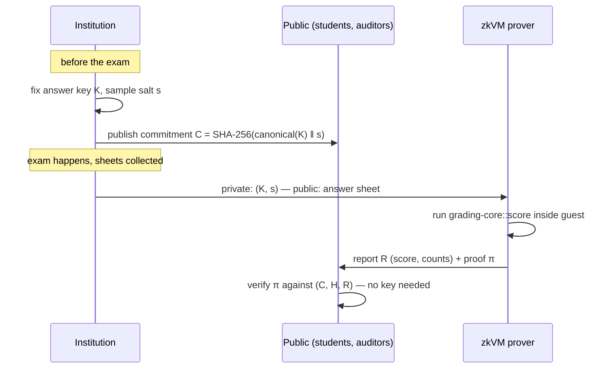

# Architecture

## Actors and flow

1. **Commit.** Before the exam, the institution canonically encodes the answer
   key (questions, weights, accepted choices, cancellation policy), appends a
   random 32-byte salt, hashes with SHA-256, and publishes the digest `C`.
2. **Grade + prove.** After the exam, for each answer sheet the zkVM guest
   receives `(K, s)` as private witness and the sheet as input, validates the
   key structurally, computes the score, and commits `(C, H, R)` as public
   outputs. The host produces proof `π`.
3. **Verify.** Anyone holding `(C, H, R, π)` verifies in milliseconds. The
   student recomputes `H` from their own copy of their answers, checks `C`
   is the pre-exam commitment, and checks the proof.

## What a valid proof establishes

- The score was produced by the **exact published grading algorithm** (the
  guest binary is public and reproducible; its image ID pins the code).
- The key used is the one committed **before the exam** (binding of SHA-256).
- The sheet graded is the one with hash `H` — the student can detect
  substitution of their answers.
- In a batched sitting, no pseudonym appears twice: `grade_batch` refuses the
  sitting otherwise, inside the guest. Without this, a second sheet under a
  real candidate's pseudonym would give the institution two proven results to
  choose between, and the candidate's check, which finds their row by sheet
  hash, would never see the second one.
- Appeals are auditable: a post-appeal regrade is a *new* commitment `C'`
  plus proofs under `C'`; both commitments stay on the record.

## What it deliberately does NOT establish (trust model)

Honesty about limits is what makes this credible:

- **Chain of custody.** quaestor proves "these recorded answers score X", not
  "these recorded answers are what the student bubbled on paper." OMR
  digitization sits outside the proof boundary (a future component can sign
  scans and hash-link them to `H`).
- **Key quality.** The proof says the committed key was applied, not that the
  committed key is academically correct. Appeals still exist; quaestor makes
  their effects visible instead of silent.
- **Salt secrecy.** If the institution leaks `s` and `K` early, hiding is
  gone (binding survives). Operational, not cryptographic, duty.
- **Who a batched row belongs to, from the outside.** A batch leaf is the
  report, and a report carries no pseudonym — so inclusion binds every
  published *score* to the proven sitting and says nothing about the name
  printed beside it. The pseudonym is bound, but through the sheet hash, whose
  preimage holds it together with the answers. The consequence is asymmetric
  and worth stating plainly: a candidate can always detect a relabelled row
  (`verify-batch --sheet` checks it), while an auditor holding no answer sheets
  structurally cannot, and quaestor says so rather than printing a pass that
  reads broader than it is. Closing it for auditors too means putting the
  pseudonym in the leaf — an ABI change, not a bug fix.

## Commitment scheme

`C = SHA-256(domain ‖ version ‖ canonical(K) ‖ s)` with:

- **Domain separation** (`quaestor/answer-key`, `quaestor/answer-sheet`) so hashes
  from one context can never be replayed in another.
- **Canonical encoding** (`encode.rs`): little-endian fixed-width integers,
  `u32` length prefixes, no serde — injectivity and eternal stability are
  security requirements, so the encoding is ~60 lines we own completely.
- **Salted** for hiding: answer keys are low-entropy (an unsalted hash of a
  20-question key can be brute-forced in seconds).
- Sheet hashes are unsalted: their job is integrity, and the student must be
  able to recompute them from data they already know.

## Why a zkVM (and which one)

Writing grading rules as hand-built circuits would make every rule change a
cryptography project. A zkVM proves ordinary RISC-V execution, so the grading
engine stays plain, auditable Rust — reviewable by an exams board, not just
cryptographers. Target: **SP1** first (fastest prover in 2026, best docs;
proving runs on Linux/WSL2 or CI — the Windows dev loop never needs it),
with the core kept strictly zkVM-agnostic so a RISC Zero or Jolt backend is a
weekend, not a rewrite.

## Scaling: batching

Per-sheet proofs are the v0 demo, and per-sheet proofs are also why v0 is a
demo: a sitting of 10^5–10^6 candidates cannot pay one proof each. A real
sitting is proven **once**. The guest grades every sheet in one execution and
commits a single Merkle root over the report leaves; each student receives that
one proof plus a `log2(n)` inclusion path — about 20 hashes for a million
candidates, which verifies in a browser tab. Proof cost per student amortizes
toward zero.

Status: built end to end. `grading_core::grade_batch` grades the sitting and
builds the tree; `zk/program-batch` is the guest that runs it and commits the
76-byte batch public values (key commitment, root, exam id, leaf count);
`quaestor-cli prove-batch` produces the proof plus the published results list,
and `verify-batch` is the student's and the auditor's side of it. The
single-sheet guest stays as the minimal reference.

The batch guest is a **separate program**, not a mode flag on the single-sheet
one. Two programs mean two verifying keys, so a batch proof cannot be presented
where a single-sheet proof is expected — a property enforced by the proof
system rather than by a field somebody has to remember to check.

Batching also moves work off the per-candidate path: key validation and the key
commitment are computed once per sitting rather than once per sheet, so a batch
costs `O(sheets + key)` instead of `O(sheets × key)`. The per-candidate report
is byte-identical either way, which is a tested invariant — otherwise batching
would quietly be a second grading system wearing the same name.

Three failure modes are closed in the construction rather than documented away,
because each would let a prover forge an inclusion claim — which, once grades
are batched, *is* the grade:

- Leaves and internal nodes are hashed under distinct tags, so no leaf preimage
  can be reinterpreted as an internal node.
- An odd node is promoted rather than paired with a copy of itself, and the root
  binds the leaf count — without which an `n`-leaf tree and an `n+1`-leaf tree
  ending in a duplicate can share a root (CVE-2012-2459's shape), letting a
  prover place a candidate in a sitting they never sat.
- A leaf is the *whole* report, sheet hash included, so two candidates with
  equal scores are still distinct leaves. Without that, a student could open the
  sitting with a same-scoring stranger's path and learn nothing about whether
  their own answers were the ones graded.

Batching introduces one failure mode that per-sheet proving does not have, and
it is the one to keep in view: **the proof covers a root, not a results page.**
An institution can prove the sitting honestly and then publish a different
number next to a name; the proof still verifies, because it was never about
that page. The inclusion path is what closes the gap, so `verify-batch` treats
a missing path as a hard rejection, and its auditor mode additionally requires
that the published list contains every position exactly once — otherwise a list
could duplicate one candidate's row and silently drop another's.

AÖF-scale sittings shard into fixed-size batches with a top-level aggregation
proof.

## Extension track (research upside)

The same machine generalizes from "answer key" to any committed decision rule:
scholarship rankings, admission lotteries (the exact case in *Accountable
Algorithms*), curve/scaling policies, and — the timely one — attested AI
grading pipelines, where the proof covers deterministic pre/post-processing
around a committed model evaluation (connecting to the zkML literature on
verifiable evaluations).
